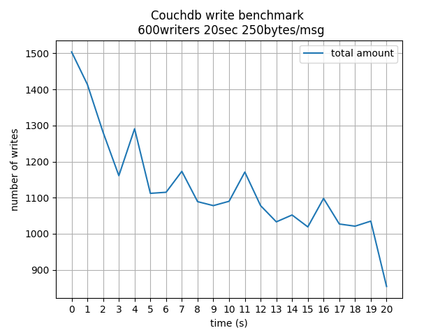
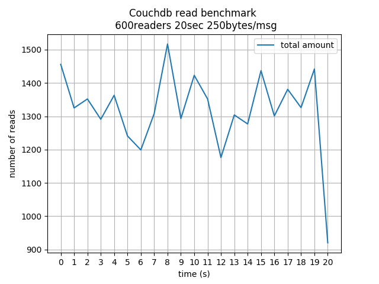
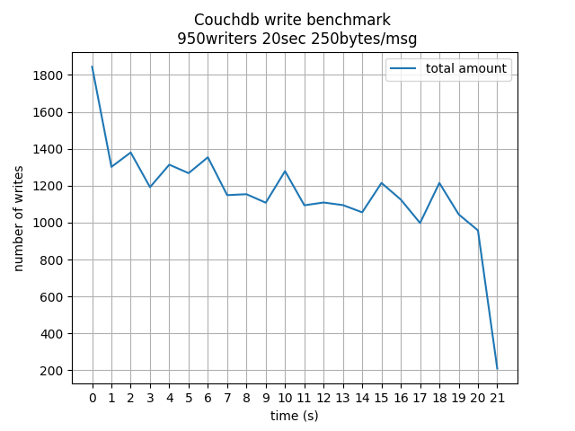
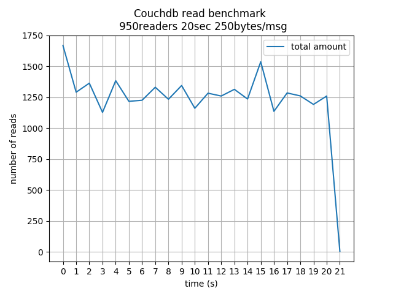
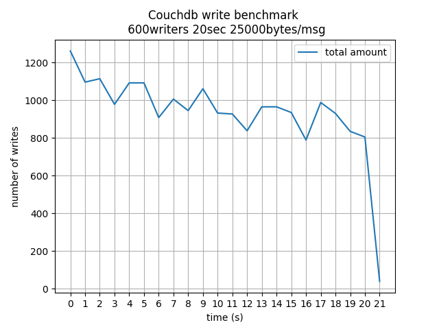
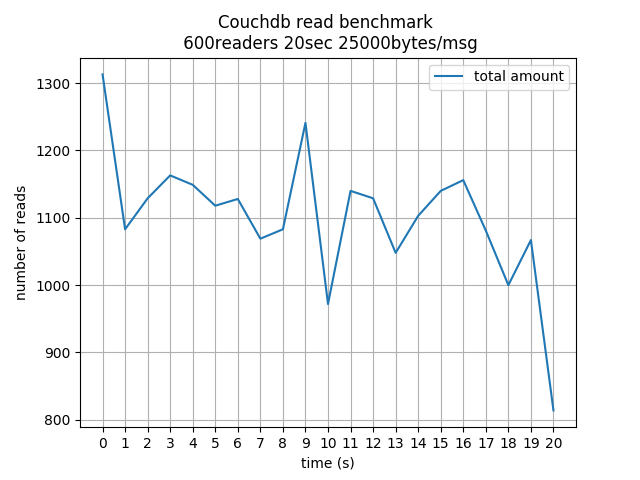

# Couchdb read & write benchmark

## Using:
 - [PyWren from Cloudbutton Toolkit](https://github.com/pywren/pywren-ibm-cloud)
 - [IBM Virtual Server](https://cloud.ibm.com/catalog/infrastructure/virtual-server-group‎)
 - [Couchdb Server](https://couchdb.apache.org/)
 - [Rabbitmq](https://www.rabbitmq.com/)
 - Python 3.6


This benchmark tests the write/read speed that a single
couchdb server can handle, using IBM Cloud Functions with
Pywren as the readers/writers clients.

It uses rabbitmq to synchronize all the functions and to trigger
the benchmark at the same time for all of them.

Also, each function deals with the same unique document, different
among all other functions.

When the test starts, every function starts writing/reading for as
long as a fixed amount of time (burst_time), saving the timestamps
for every action.


## Replication

Only one script is used to run this test, and that is [bm_couchdb.py](/bm_couchdb.py)\
Documents are also referred to as messages.

```
  python3 bm_couchdb.py -n <num_action_performers> -t <burst_time_sec> -s <msg_size_bytes>
```

You must also edit the variable *COUCHDB_ENDPOINT* which holds the endpoint to the
couchdb server.

Two graphs are plotted every time showing the average amount and the total amount\
among all invokes of reads/writes actions on each second (or intervals [0,1), [1,2) ...).

### Examples

```
  python3 bm_couchdb.py -n 600 -t 20 -s 250
```

```
  python3 bm_couchdb.py -n 100 -t 20 -s 10000
```

----

## Some results






### Hardware used:
 - Instance: Balanced B1.2x4\
 - CPU: 2x vCPU\
 - RAM: 4GB\
 - Bandwidth: 1Gbps\
 - OS: Ubuntu Linux 18.04 LTS Bionic Beaver Minimal Install (64 bit)\
Both server and functions shared the same region (London).

### Observations:

In this test we use document sizes of 250 bytes to test overhead limits
or even the update of a (small) state.\
Many graphs show unstability in the server and that might be because
it is very small in terms of resources, but it serves for comparisons
with other services.

We can conclude that the average throughput settles at around 1200 writes per
second and 1300 reads per second.




Finally, we these are the graphs showing the results of running the test using message/document
sizes of 25kB. We can observe that the increase in size only affected the throughput by roughly
a 10%.


